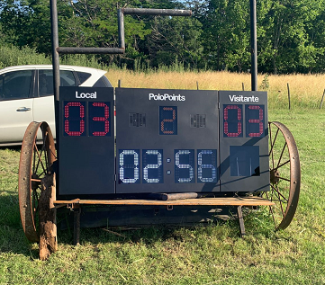
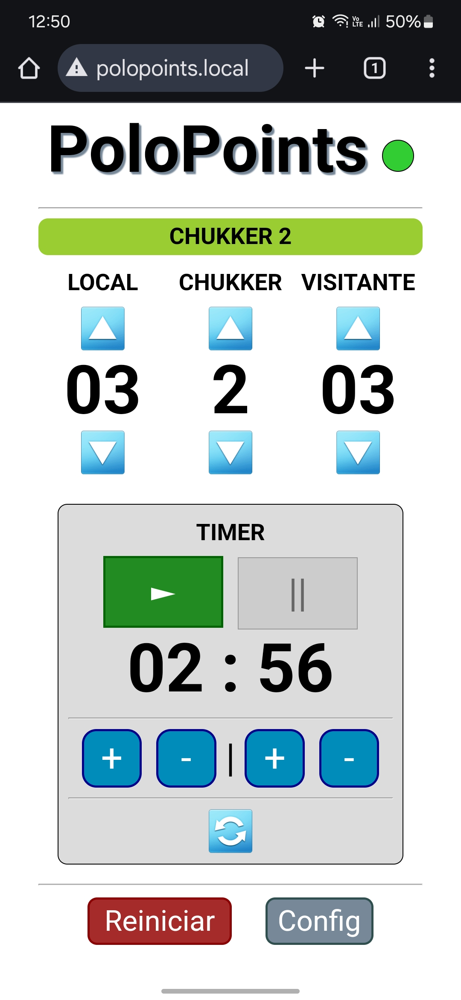
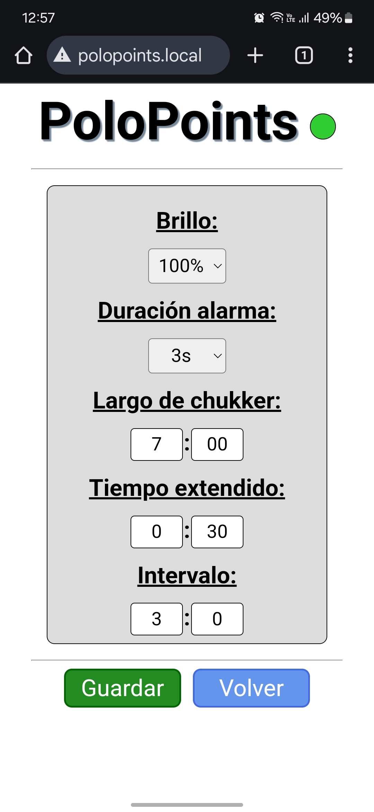

# PoloPoints
App para administrar un tablero de LEDs deportivo pensado para Polo, a través de una interfaz WiFi. La app permite administrar puntajes local y visitante, chukker y temporizador.

El proyecto está implementado con un dispositivo ESP32, que genera por WiFi un access point (AP), administra las solicitudes HTTP, se comunica a través de RS232 con la placa controladora de LEDs y gestiona el uso de una señal sonora.

Se ofrece también un front-end en la dirección del host para utilizar las funcionalidades de aplicación.

Los datos de la red son los siguientes:
* **Dominio**: 'polopoints.local' &rarr; se accede mediante este dominio dado que la IP puede variar.
* **SSID**: 'PoloPoints'
* **PASS**: '12345678'

Es posible incrementar/decrementar puntajes (local y visitante) y chuker. El temporizador puede iniciarse, frenarse o resetarse, como así también modificar su valor actual o el default. Programado inicialmente en valores estándar de Polo: 7' cada chukker con 30'' adicionales sobre el final (total 7' 30'') y los 3' de descanso entre chukkers.

El proyecto administra una señal sonora para distintos eventos de cada chukker, la cual cuenta con dos formatos: el uo del DAC del dispositivo ESP32 para emitir una señal de audio que luego es amplificada de forma externa o bien el disparo de un relay que activa unas bocina de aire que un compreor externo.

El front-end incorpora un indicador de conectividad, en caso de exceder el límite del alcance de la señal WiFi del tablero (aprox. 100mts).

## Imágenes de referencia
<table style="text-align: center">
  <tr>
    <td colspan="2">
        
    </td>
  </tr>
  <tr>
    <td></td>
    <td></td>
  </tr>
</table>

## IDE
Proyecto desarrollado inicialmente en el IDE de Arduino y luego migrado a Visual Studio Code, mediante la extensión Platform IO.